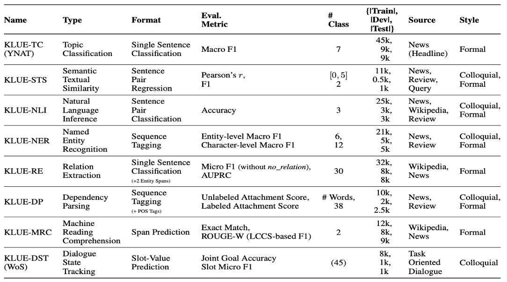

# Fine-Tuning on KLUE baseline model with Transformers Notebooks 
### *- Exploring the KLUE dataset and Fine Tuning bert-based pretrained model -*


#### KLUE란?
[**KLUE**](https://arxiv.org/pdf/2105.09680.pdf)란 한국어 자연어 이해 평가 데이터셋(Korean Language Understanding Evaluation Benchmark)의 약자로, 한국어 언어모델의 공정한 평가를 위한 목적으로 8개 종류(뉴스 헤드라인 분류, 문장 유사도 비교, 자연어 추론, 개체명 인식, 관계 추출, 형태소 및 의존 구문 분석, 기계 독해 이해, 대화 상태 추적)의 한국어 자연어 이해 문제가 포함된 공개 데이터셋. 추가적으로 한국어 언어 모델의 공정한 성능 비교를 위해 평가 시스템 및 사전학습 [**Baseline 모델**](https://github.com/KLUE-benchmark/KLUE) 공개.  


#### Dependency

```
transformers==4.27
sentence-transformers==2.2.0
evaluate==0.4.0
datasets==2.10
```

#### Task Overview



#### Colab URL 

|Task|Colab|
|:---|:---|
|KLUE-TC|[](https://colab.research.google.com/drive/1hly1hhGZjGgae4zb2J8Ox890ecQjnpmr?usp=share_link)|
|KLUE-STS|[](https://colab.research.google.com/drive/1hly1hhGZjGgae4zb2J8Ox890ecQjnpmr?usp=share_link)|
|KLUE-NLI|[](https://colab.research.google.com/drive/11qtug9b787c3hBBjK_ssieM6WD1ikUFv?usp=sharing)|
|KLUE-NER|[](https://colab.research.google.com/drive/15jiJJVSgykXGA8Hpndr_sOdOdlbF2B-A?usp=share_link)|
|KLUE-RE|[](https://colab.research.google.com/drive/1hly1hhGZjGgae4zb2J8Ox890ecQjnpmr?usp=share_link)|
|KLUE-DP|[](https://colab.research.google.com/drive/1NbhMQTirAvgKE67DAvsGqRWB3Zylq2cd?usp=share_link)|
|KLUE-MRC|[](https://colab.research.google.com/drive/1QlOedmoDCrN8v31wkIo0sAshaeiyE3zx?usp=sharing)|
|KLUE-DST|[](https://colab.research.google.com/drive/1XV8iRACIvUOx67VYcH1h1AOGMUkzy2zR?usp=sharing)|


#### Reference 

https://arxiv.org/pdf/2105.09680.pdf

https://github.com/KLUE-benchmark/KLUE-baseline

https://github.com/KLUE-benchmark/KLUE

https://github.com/Huffon/klue-transformers-tutorial

 
